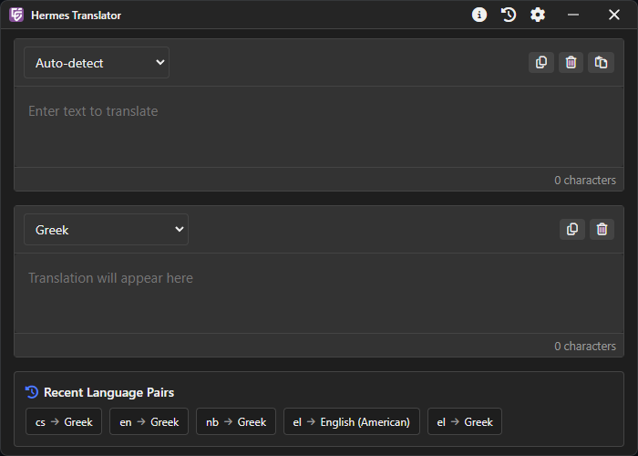
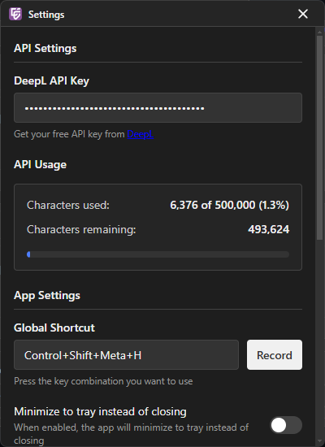
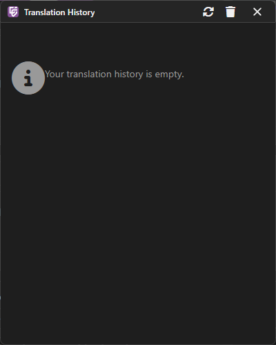
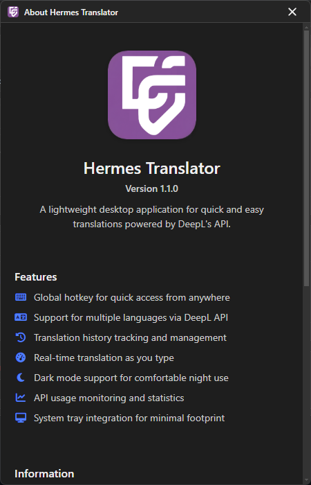

# Hermes Desktop Translator

A lightweight desktop application for quick and easy translations powered by DeepL's API. The app provides a streamlined interface for translating text between multiple languages with a simple keyboard shortcut.

## Features

- **Global Hotkey:** Translate text with a customizable keyboard shortcut from anywhere on your computer
- **Modern UI:** Clean, dark-mode compatible interface with intuitive controls
- **High-Quality Translation:** Powered by DeepL's advanced neural network translation
- **Multiple Languages:** Support for all languages offered by DeepL API
- **Translation History:** Keep a record of your recent translations for quick reference
- **System Tray Integration:** Runs quietly in the background until needed
- **API Usage Monitoring:** Track your DeepL API usage directly in the settings

## Screenshots

### Main Translation Window


### Settings Window


### History Window


### About Window


## Installation

### Prerequisites

- Node.js (v14 or higher)
- npm or yarn
- A DeepL API key (free tier available at [DeepL API](https://www.deepl.com/pro-api))

### Setup

1. Clone this repository:
   ```
   git clone https://github.com/adamosk/hermes-desktop-translator.git
   cd hermes-desktop-translator
   ```

2. Install dependencies:
   ```
   npm install
   ```

3. Start the application:
   ```
   npm start
   ```

### Building for Production

To create a production build:

```
npm run build
```

This will create distributable packages in the `dist` folder.

### Creating Releases

To build for specific platforms:

```bash
# Windows
npm run build:win

# macOS
npm run build:mac

# Linux
npm run build:linux
```

To create a GitHub release:

1. Update the version in `package.json`
2. Create a Git tag that matches the version: `git tag v1.1.0`
3. Push the tag: `git push --tags`
4. Run: `npm run release`

This will build the app for all platforms and publish a new release on GitHub.

## Usage

1. **First Run Setup:**
   - On first launch, you'll need to enter your DeepL API key in the settings window
   - Get a free DeepL API key at https://www.deepl.com/pro-api

2. **Translating Text:**
   - Copy text to your clipboard or type directly in the source text area
   - Use the global shortcut (default: Ctrl+Shift+Meta+H) to open the translator window
   - Select source and target languages from the dropdown menus
   - View the translation in the target text area
   - Copy the translation using the copy button or keyboard shortcut

3. **Translation Settings:**
   - **API Settings:** Enter your DeepL API key and monitor your API usage
   - **App Settings:** Configure global shortcut and system tray behavior
   - **Translation Settings:** Enable/disable real-time translation, dark mode, and history tracking

4. **Translation History:**
   - Access your translation history from the history button in the toolbar
   - Use previous translations with a single click
   - Clear individual entries or the entire history as needed

5. **About Dialog:**
   - View application version and system information
   - Access the project's GitHub repository
   - View license information and credits

## Application Settings

### API Settings
- **DeepL API Key:** Your DeepL API authentication key
- **API Usage:** Monitor character count usage and limits

### App Settings
- **Global Shortcut:** Customize the keyboard shortcut for quick access
- **Minimize to Tray:** Enable to keep the app running in the system tray when closed
- **ESC Key Behavior:** Configure how the ESC key interacts with the app
- **Lost Focus Behavior:** Choose whether the app closes when focus is lost

### Translation Settings
- **Auto-translate Clipboard:** Automatically translate clipboard contents
- **Real-time Translation:** Translate as you type
- **Tray Notifications:** Show notifications when minimized to tray
- **Dark Theme:** Toggle between light and dark themes
- **Translation History:** Enable/disable saving of translation history

## Development

- `npm start` - Run the app in development mode
- `npm run dev` - Run with development features enabled
- `npm run build` - Build for production

## License

ISC

## Credits

Built with:
- [Electron](https://www.electronjs.org/)
- [DeepL API](https://www.deepl.com/pro-api)
- [Font Awesome](https://fontawesome.com/) for UI icons 